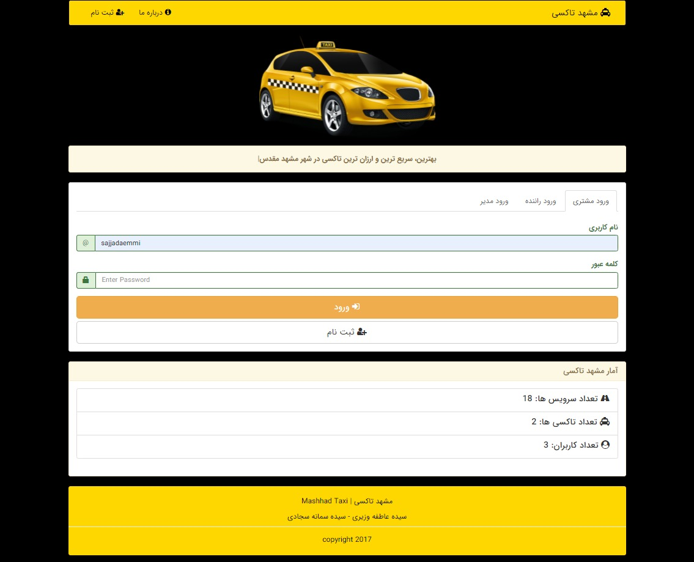

# Mashhad-Taxi

Mashhad-Taxi is an Iranian vehicle for hire company. Users can request a ride via the web application, by indicating their location and destination. The price of the trip is set beforehand, to eliminate bargaining. this is a popular ride-hailing platform in Iran. This website uses PHP as back-end programming language.


## usage
1- Import mashhad_taxi.sql in phpMyAdmin.

2- open index.php in browser:
```
localhost/Mashhad-Taxi/index.php
```
Login as Admin with
```
username: admin
password: 1234
```


